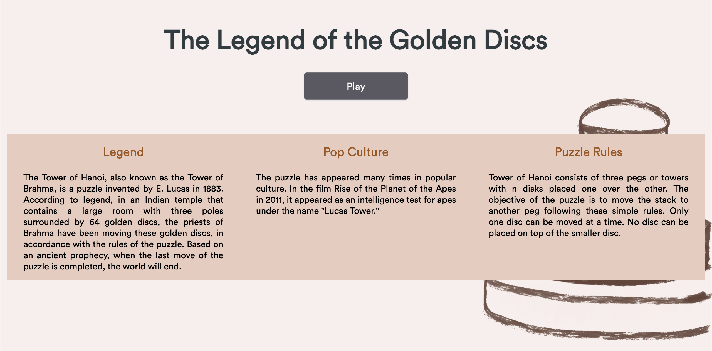

<div id="top"></div>
<!--
*** Thanks for checking out the Best-README-Template. If you have a suggestion
*** that would make this better, please fork the repo and create a pull request
*** or simply open an issue with the tag "enhancement".
*** Don't forget to give the project a star!
*** Thanks again! Now go create something AMAZING! :D
-->

<!-- PROJECT SHIELDS -->
<!--
*** I'm using markdown "reference style" links for readability.
*** Reference links are enclosed in brackets [ ] instead of parentheses ( ).
*** See the bottom of this document for the declaration of the reference variables
*** for contributors-url, forks-url, etc. This is an optional, concise syntax you may use.
*** https://www.markdownguide.org/basic-syntax/#reference-style-links
-->

[![Contributors][contributors-shield]][contributors-url]
[![Forks][forks-shield]][forks-url]
[![Stargazers][stars-shield]][stars-url]
[![Issues][issues-shield]][issues-url]
[![LinkedIn][linkedin-shield]][linkedin-url]

<!-- PROJECT LOGO -->
<br />
<div align="center">
  <a href="https://github.com/github_username/repo_name">
    
  </a>

<h3 align="center">Tower of Hanoi</h3>

  <p align="center">
    This project is a virtual rendition of the mathematical puzzle, Tower of Hanoi built with HTML, CSS, and Javascript
    <br />
    <a href="https://github.com/cdizon239/tower-of-hanoi"><strong>Explore the docs »</strong></a>
    <br />
    <br />
    <a href="https://github.com/cdizon239/tower-of-hanoi">View Demo</a>
    ·
    <a href="https://github.com/cdizon239/tower-of-hanoi/issues">Report Bug</a>
    ·
    <a href="https://github.com/cdizon239/tower-of-hanoi/issues">Request Feature</a>
  </p>
</div>

<!-- TABLE OF CONTENTS -->
<details>
  <summary>Table of Contents</summary>
  <ol>
    <li>
      <a href="#about-the-project">About The Project</a>
      <ul>
        <li><a href="#built-with">Built With</a></li>
      </ul>
    </li>
    <li>
      <a href="#getting-started">Getting Started</a>
      <ul>
        <li><a href="#prerequisites">Prerequisites</a></li>
        <li><a href="#installation">Installation</a></li>
      </ul>
    </li>
    <li><a href="#usage">Usage</a></li>
    <li><a href="#roadmap">Roadmap</a></li>
    <li><a href="#contributing">Contributing</a></li>
    <li><a href="#license">License</a></li>
    <li><a href="#contact">Contact</a></li>
    <li><a href="#acknowledgments">Acknowledgments</a></li>
  </ol>
</details>

<!-- ABOUT THE PROJECT -->

## About The Project

[![Product Name Screen Shot][product-screenshot]](https://cdizon239.github.io/tower-of-hanoi/)

Tower of Hanoi is a mathematical puzzle that consists of three pegs or towers with n disks placed one over the other. The objective of the puzzle is to move the stack to another peg following these simple rules. Only one disc can be moved at a time. No disc can be placed on top of the smaller disc.

Features:

- Allowing a user to move disks from one peg to another if it is a valid move
- Tracks time and counts the number of moves per turn
- Ability to reset the game
- Increase level / number of discs to solve
- Access to a solve button that also animates how to finish the puzzle
- Access to a table of Best moves per level (i.e. number of discs)

<p align="right">(<a href="#top">back to top</a>)</p>

### Built With

- HTML
- CSS
- JavaScript

<p align="right">(<a href="#top">back to top</a>)</p>

<!-- GETTING STARTED -->

## Getting Started

To get a local copy up and running follow these simple example steps.

### Prerequisites

This is an example of how to list things you need to use the software and how to install them.

- npm
  ```sh
  npm install npm@latest -g
  ```

### Installation

1. Clone the repo
   ```sh
   git clone https://github.com/cdizon239/tower-of-hanoi.git
   ```

<p align="right">(<a href="#top">back to top</a>)</p>

<!-- USAGE EXAMPLES -->

## Usage

Game is available on Desktop and Mobile. Turns out there's always a fun way you could exercise your brain wherever you are!



_For more examples, please refer to the [Documentation](https://example.com)_

<p align="right">(<a href="#top">back to top</a>)</p>

<!-- ROADMAP -->

## Roadmap

- [x] Support single player
- [x] Track number of times solves and minimum moves across sessions by level
- [x] Solve functionality for all discs levels
  - [] Allow user to control animation speed on solve
- [x] Support multiplayer solves and leaderboard

See the [open issues](https://github.com/cdizon234/tower-of-hanoi/issues) for a full list of proposed features (and known issues).

<p align="right">(<a href="#top">back to top</a>)</p>

<!-- CONTRIBUTING -->

## Contributing

Contributions are what make the open source community such an amazing place to learn, inspire, and create. Any contributions you make are **greatly appreciated**.

If you have a suggestion that would make this better, please fork the repo and create a pull request. You can also simply open an issue with the tag "enhancement".
Don't forget to give the project a star! Thanks again!

1. Fork the Project
2. Create your Feature Branch (`git checkout -b feature/AmazingFeature`)
3. Commit your Changes (`git commit -m 'Add some AmazingFeature'`)
4. Push to the Branch (`git push origin feature/AmazingFeature`)
5. Open a Pull Request

<p align="right">(<a href="#top">back to top</a>)</p>

<!-- CONTACT -->

## Contact

Charmille Dizon - [@charmille_dizon](https://twitter.com/charmille_dizon) - coleencharmille@gmail.com

Project Link: [https://github.com/cdizon239/tower-of-hanoi](https://github.com/cdizon239/tower-of-hanoi)

<p align="right">(<a href="#top">back to top</a>)</p>

<!-- ACKNOWLEDGMENTS -->

## Acknowledgments

- [MDN Web Docs](https://developer.mozilla.org/en-US/docs/Web/JavaScript)
- [Github Pages](https://pages.github.com/)
- [Noun Project](https://thenounproject.com/)
- [CSS-Tricks Guide to Flexbox](https://css-tricks.com/snippets/css/a-guide-to-flexbox/)

<p align="right">(<a href="#top">back to top</a>)</p>

<!-- MARKDOWN LINKS & IMAGES -->
<!-- https://www.markdownguide.org/basic-syntax/#reference-style-links -->

[contributors-shield]: https://img.shields.io/github/contributors/cdizon239/tower-of-hanoi.svg?style=for-the-badge
[contributors-url]: https://github.com/cdizon239/tower-of-hanoi/graphs/contributors
[forks-shield]: https://img.shields.io/github/forks/cdizon239/tower-of-hanoi.svg?style=for-the-badge
[forks-url]: https://github.com/cdizon239/tower-of-hanoi/network/members
[stars-shield]: https://img.shields.io/github/stars/cdizon239/tower-of-hanoi.svg?style=for-the-badge
[stars-url]: https://github.com/cdizon239/tower-of-hanoi/stargazers
[issues-shield]: https://img.shields.io/github/issues/github_username/repo_name.svg?style=for-the-badge
[issues-url]: https://github.com/cdizon239/tower-of-hanoi/issues
[linkedin-shield]: https://img.shields.io/badge/-LinkedIn-black.svg?style=for-the-badge&logo=linkedin&colorB=555
[linkedin-url]: https://linkedin.com/in/charmille-coleen-dizon
[product-screenshot]: ./images/productDemo.gif
